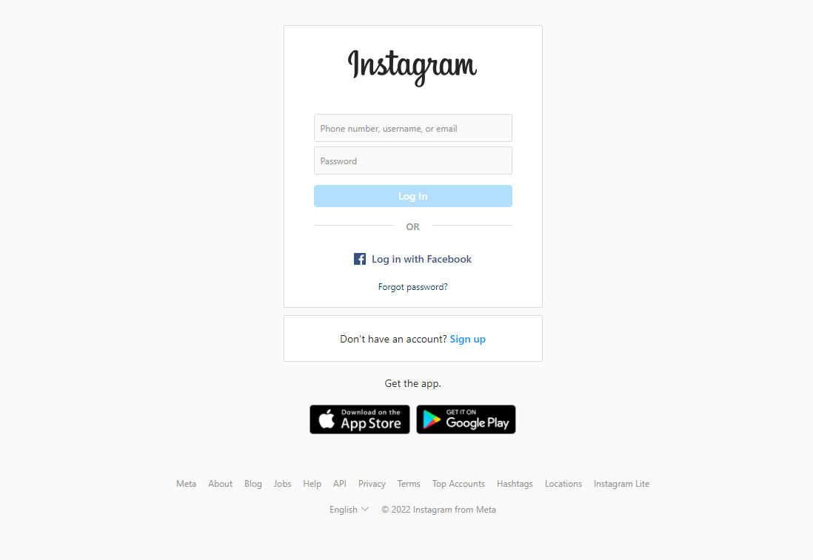
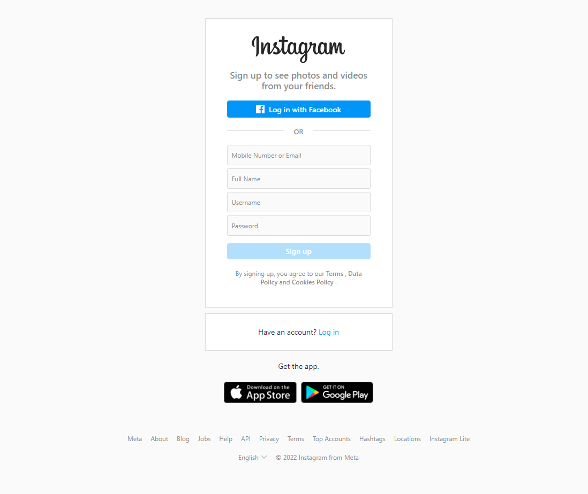
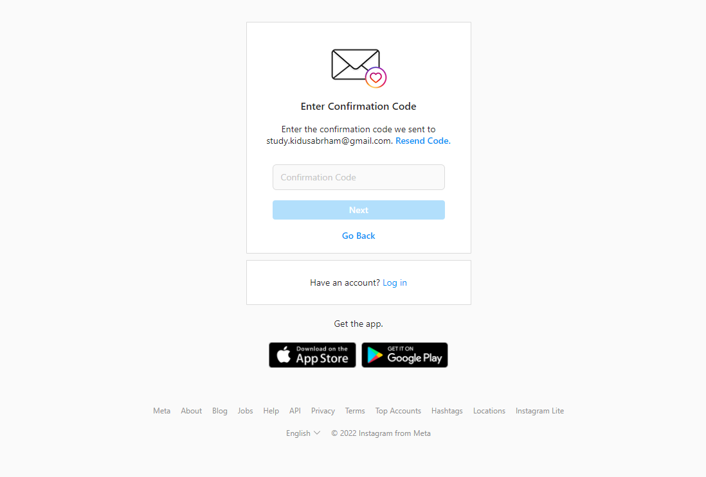
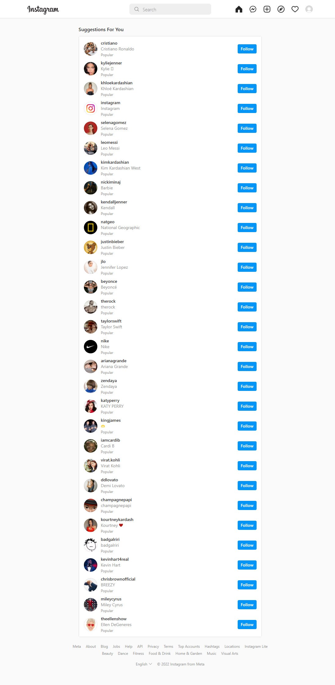
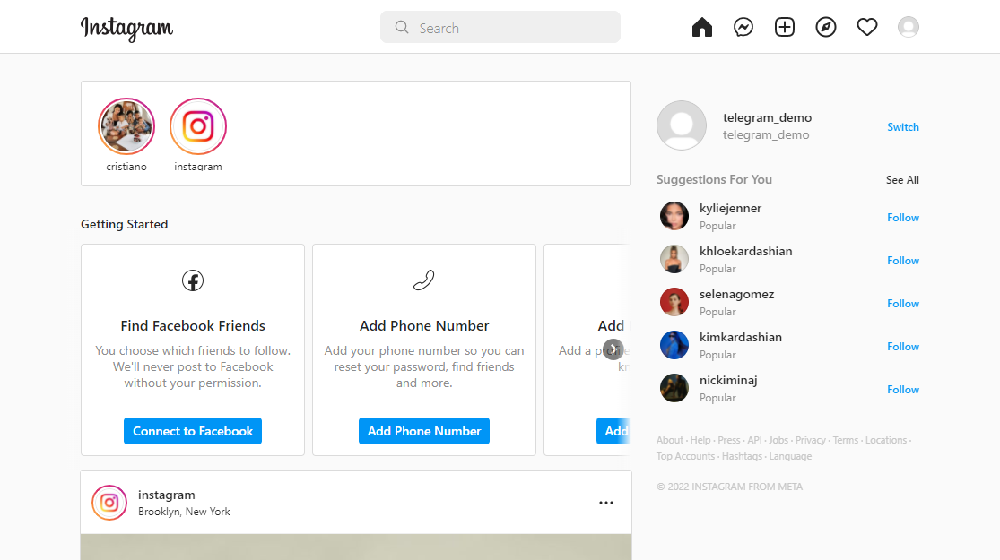
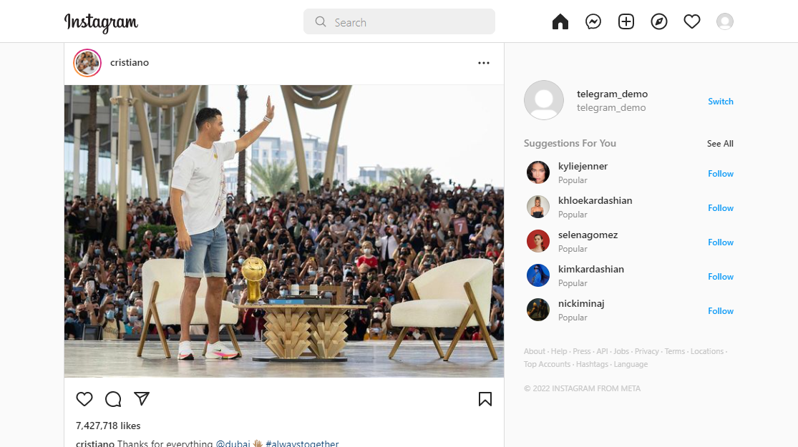
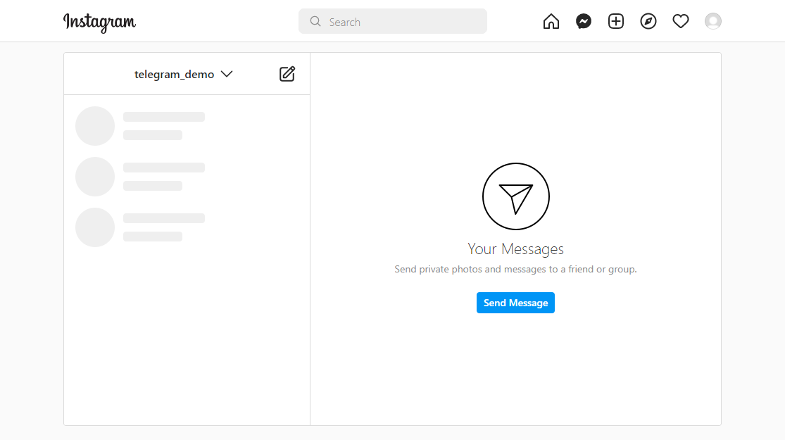
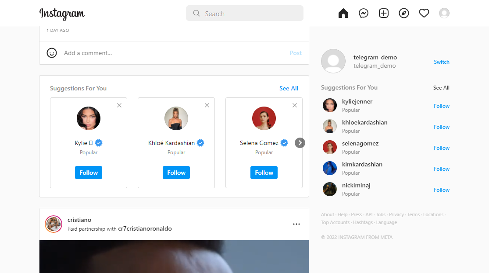
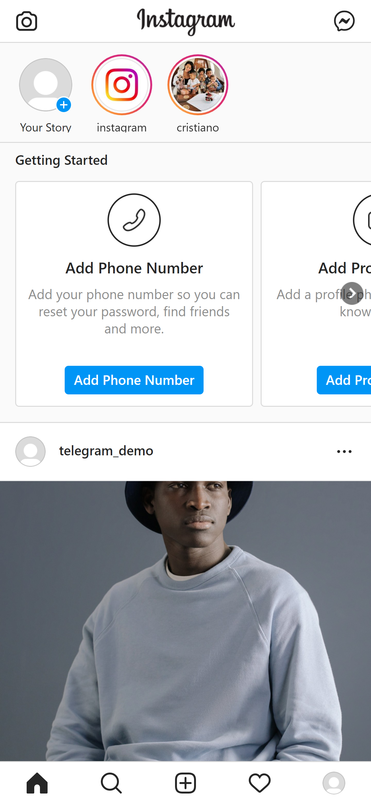
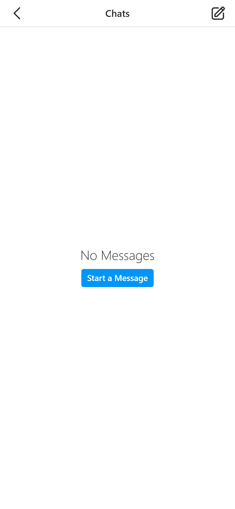

# Instagram Clone

## Prerequests

- NodeJs Or [NodeJs Download link](https://nodejs.org/en/download/)
- Postman Or [Postman Download link](https://www.postman.com/downloads/)
- Chrome Or [Chrome Download link](https://www.google.com/chrome/)
- Git Or [Git Download link](https://git-scm.com/downloads)
- Xampp Or [Xampp Download link](https://www.apachefriends.org/download.html)

# what we will build
- Full instagram clone from scratch

## Login

## signup

## Email confirmation

## new user suggestions

## fill information

## homepage 

## Chat 

## Suggestions 

# Mobile Version(responsiveness)
## homepage

## Chat

## Explore
 
## Profile

### If you have any questions or doubts please feel free to contact [Adulis developers](https://t.me/adulis_developers) 